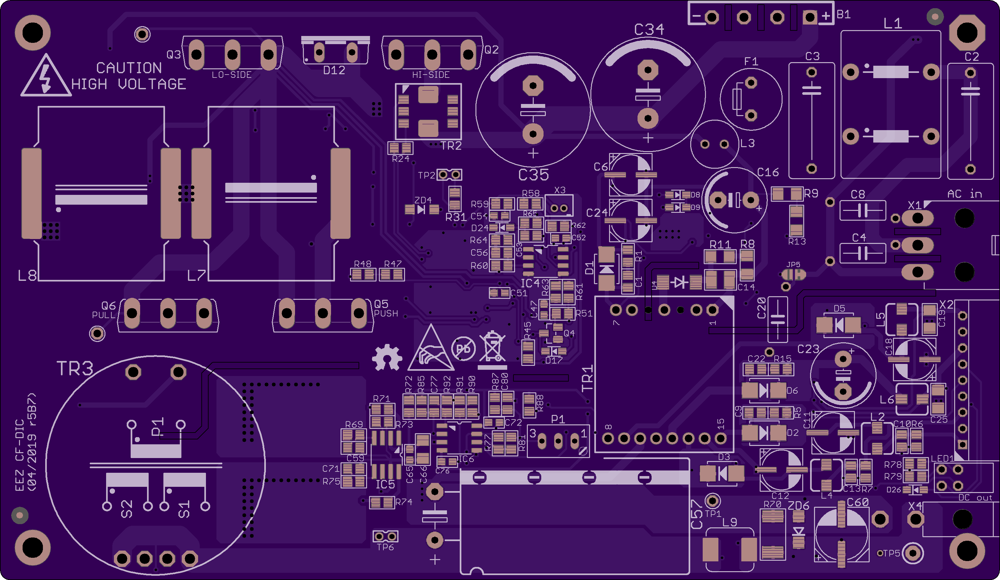
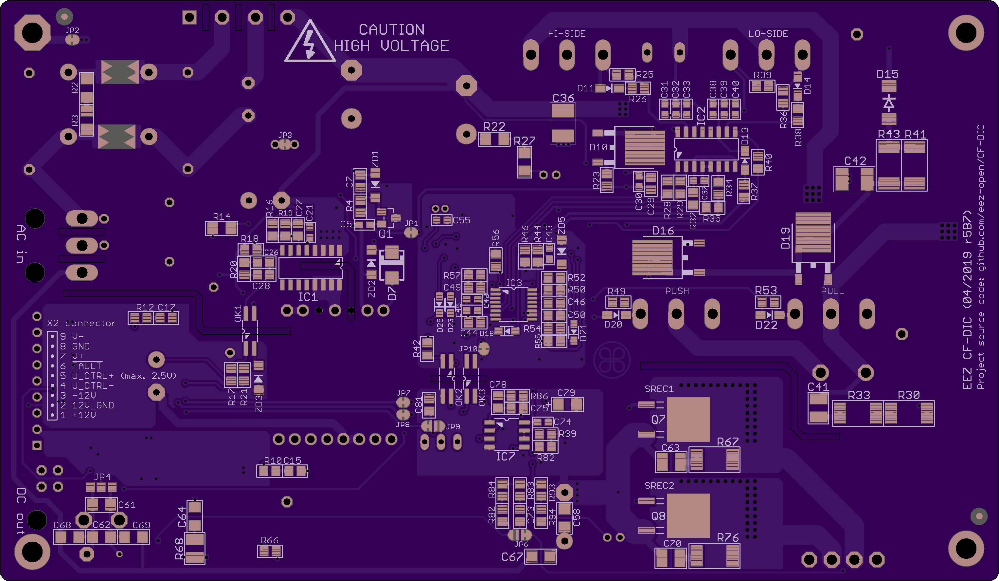

Current-fed dual inductor converter (CF-DIC) project files (work in progress!)

Inspired by article Filho, Barbi (1996), *[A comparison between two current-fed push-pull DC-DC converters-analysis, design and experimentation](https://www.researchgate.net/publication/3673781_A_comparison_between_two_current-fed_push-pull_DC-DC_converters-analysis_design_and_experimentation)* and made with great assistance of Dragoljub Aleksijević (aka *Macola*).

### Feature list

* Wide AC input 85 - 265 V
* Wide DC output: 3 - 52 V
* Output voltage controlled by tracker circuit or optionally with TL431 + trimpot
* Cascaded PWM Controller LM5041B (sync buck + push-pull stage)
* Isolated HV power ground and signal ground for improved noise immunity
* High performance SiC MOSFET switches
* High performance Vitroperm 500 F core material for power transformer
* Max. current 5 A continuously (i.e. max. power is 260 W)
* Synchronous rectifier with low R(gs,on) MOSFET switches
* "Power good" output
* Bias power supply outputs: +5 V, -5 V, -8 V, and +20 V
* Over-current protection (OCP)
* Output over-voltage protection (OVP)
* Optional temperature alarm with hysteresis
* f(sw,buck)= ~68 kHz, f(sw,pp)= ~34 kHz
* QR flyback as bias power supply (VIPer35)
* Compact size (155 x 85 mm)

### PCB layout preview

*Top layer*

*Bottom layer*