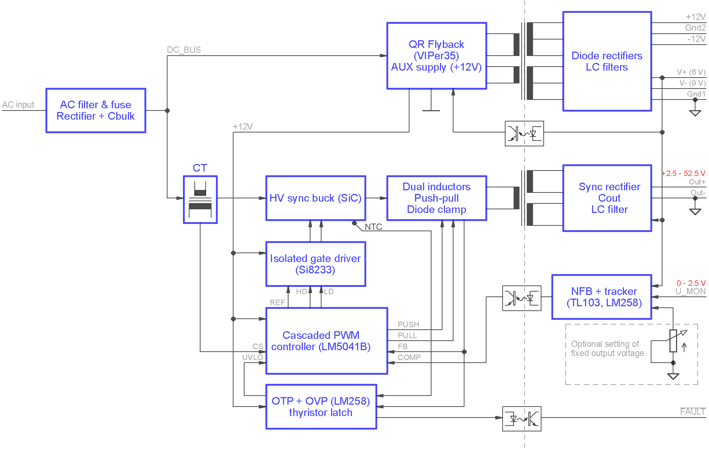
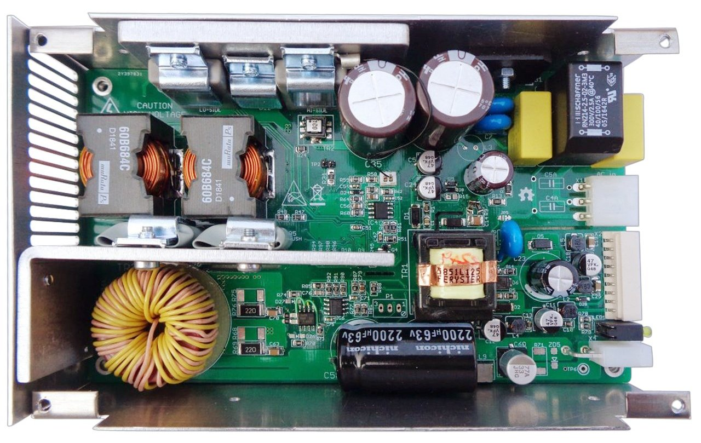

Current-fed dual inductor converter (CF-DIC) project files

Inspired by article Filho, Barbi (1996), *[A comparison between two current-fed push-pull DC-DC converters-analysis, design and experimentation](https://www.researchgate.net/publication/3673781_A_comparison_between_two_current-fed_push-pull_DC-DC_converters-analysis_design_and_experimentation)* and made with great assistance of Dragoljub Aleksijević (aka *Macola*).

### Feature list

* Wide range input: 85 – 265 Vac, 120 – 380 Vdc
* Wide range output: 2.5 – 52.5 Vdc 
* Max. current 3 A continuously, or 5 A with forced-air cooling (max. power up to ~260 W)
* Output voltage controlled by tracker circuit or optionally with multiturn trimpot if fixed output voltage is required
* Cascaded PWM Controller LM5041B (sync buck + push-pull stage)
* Isolated HV power ground and signal ground for improved noise immunity
* HV buck section with high performance SiC MOSFET switches
* High performance Vitroperm 500F core material for power transformer
* Synchronous rectifier with low R(ds,on) MOSFET switches
* Active Duty cycle limiter
* Over-voltage (OVP), short circuit protection and over-temperature protection (OTP) with latched shutdown and opto-isolated open-collector "Fault" output
* Over-current protection (OCP)
* QR flyback as bias power supply (VIPer35)
* Four bias power supply outputs: +6.5 V, -8 V and "floating" +12 V / -12 V that can be further regulated with LDOs
* Compact size: 155 x 90 x45 mm
* Weight (with enclosure): 0.49 kg

### r5B6 prototype

